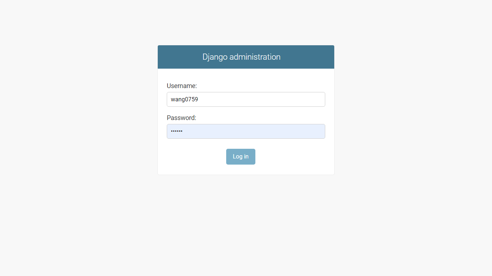
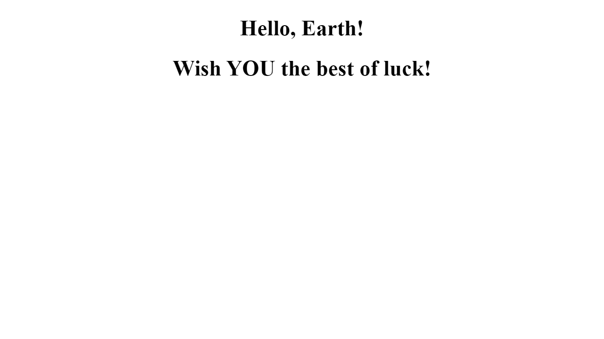
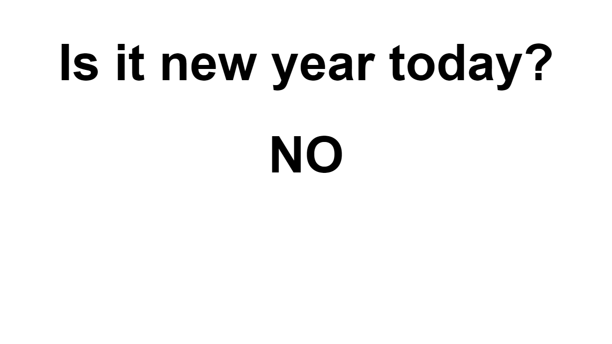
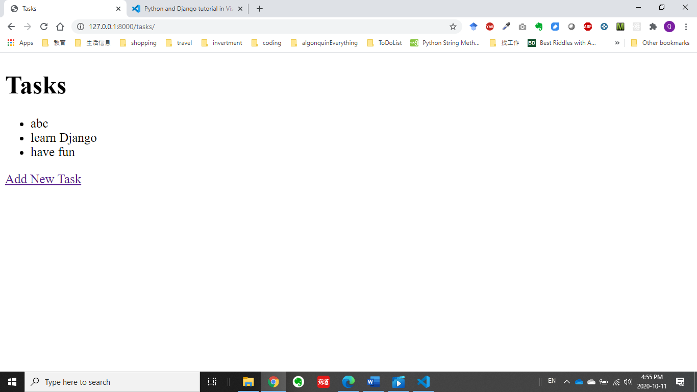

# Hello Django; Is it New Year today? tasks...
Django introduction/review

Basic steps: 
1.environment setup: https://code.visualstudio.com/docs/python/tutorial-django
2.Goes into the folder you want to start the project, run:
django-admin startproject hello 
3. Modify Settings.py, add 'hello' in INSTALLED_APPS
4. Modify hello/views.py
5. Modify urls.py under project name: hello/urls.py: path('hello/', include("hello.urls")

# Images of Finished Project

